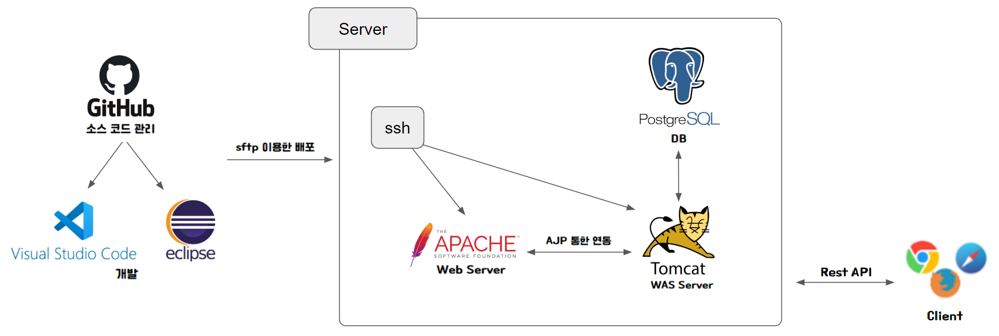

    <h1>🙂Welcome to <b>Moyeo</b>🙂</h1>

### Moyeo는 개인 서버를 갖고 싶어 시작한 개인 프로젝트 입니다. [@choiyeju](https://github.com/choiyeju)의 포트폴리오를 정리하는 공간 입니다.

 

    <h1>✨Back-End Server</h1>

 

## **Github Url**

> private 
> [https://github.com/moyeo-portfolio/moyeo-server](https://github.com/moyeo-portfolio/moyeo-server)

 

## **기술 스택**

<!-- (현재 미사용) -->

     

 

## **개발 환경**

### **Server**

- centOS 7.5 
- Apache 2.4.6 
- Tomcat9 

### **Back-End**

- java 1.8 
- maven 
- spring 4.0.9 

 

## **시스템 구성도**

 

    <h1>✨Front-End</h1>

 

## **Github Url**

> public 
> [https://github.com/moyeo-portfolio/moyeo-client](https://github.com/moyeo-portfolio/moyeo-client)

 

## **기술 스택**

     

 

## **개발 환경**

- react 18.2.0 
- typescript 4.9.4 

 

 

## **Management**

 

## **Author**

👤 choiyeju 
Github: [@choiyeju](https://github.com/choiyeju)

👤 orennamu 
Github: [@orennamu](https://github.com/orennamu)

 

## **📝 License**

Copyright © 2022 choiyeju. orennamu.

This project is MIT licensed.
